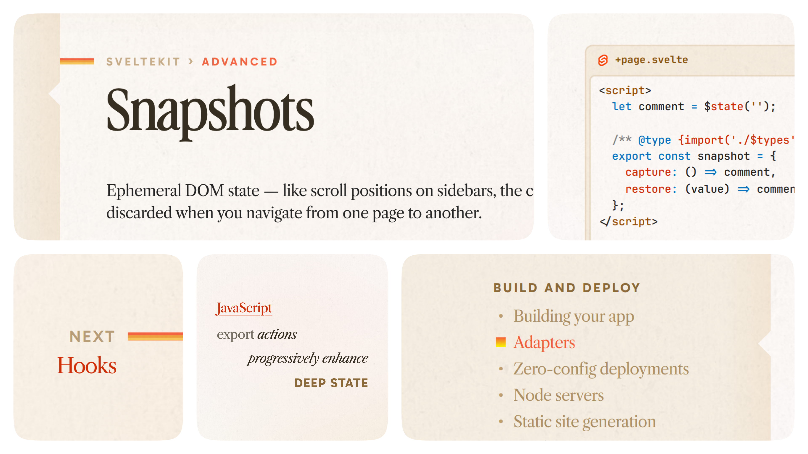

# SvelteRetro: A '90s Tech Aesthetic Makeover
I noticed Svelte 5's branding attempted a serif-focused design direction, but the chosen typography and color palette didn't quite achieve that vision. I've created an alternative stylesheet that takes a different approach, drawing inspiration from 1990s technology advertising aesthetics to capture that nostalgic feel.

## The Cool Stuff
- **That Nostalgic Serif**: [Advercase](https://indieground.net/product/advercase-font/) brings the retro headlines to life
- **Fresh Sans**: [Gabarito](https://fonts.google.com/specimen/Gabarito) keeps things crisp where needed
- **Code with Character**: [JetBrains Mono](https://www.jetbrains.com/lp/mono/) makes your code pop
- **Classic Body Text**: [Libre Caslon Text](https://fonts.google.com/specimen/Libre+Caslon+Text) for that timeless readability
- **Relaxing Colors**: A gruvbox-inspired palette that's easy on the eyes
- **Textured Touch**: Subtle grain on a warm background that feels like vintage paper
- **Logo++**: A fresh take that just feels right
- **Code in Style**: Containers that make your code blocks stand out, complete with a little Svelte flair
- **Retro Racing Stripes**: Strategic color accents that add that perfect '90s tech magazine feel

## Installation
1. Download and install the fonts:
	- [Advercase](https://indieground.net/product/advercase-font/)
	- [Gabarito](https://fonts.google.com/specimen/Gabarito)
	- [JetBrains Mono](https://www.jetbrains.com/lp/mono/)
	- [Libre Caslon Text](https://fonts.google.com/specimen/Libre+Caslon+Text)
2. Install the Stylus browser extension for your browser:
	- [**Chrome**(ium)/**Brave**](https://chrome.google.com/webstore/detail/stylus/clngdbkpkpeebahjckkjfobafhncgmne)
	- [**Firefox**](https://addons.mozilla.org/en-US/firefox/addon/styl-us/)
3. Click [here](https://raw.githubusercontent.com/Rudraksh88/svelte-retro/refs/heads/master/styles.user.css) to install the userstyle
or
Copy the contents of `styles.user.css` and paste it into a new style in the Stylus extension.

## Wait! But in a Friend Way...
Hey there! Before you get too excited – this is my love letter to Svelte.dev, wrapped in a custom stylesheet that gives it that sweet retro makeover you're seeing. Think of it as fan art, but with CSS!

Just to keep things crystal clear: this is totally unofficial and was created purely for fun during my late-night coding sessions. While I absolutely adore Svelte (can you tell?), this project isn't connected to the official team in any way. It's just one developer's nostalgic interpretation of an already awesome framework.

Feel totally free to use it if it sparks joy for you – or scroll on by if it's not your cup of tea. either way, we're cool! 🚀

## Contributing
If you have any suggestions or improvements, feel free to open an issue or PR. I'd love to hear your thoughts!